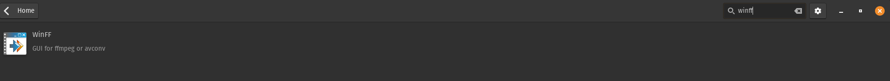
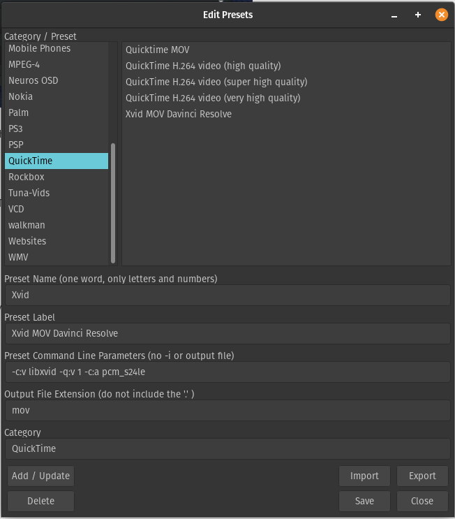
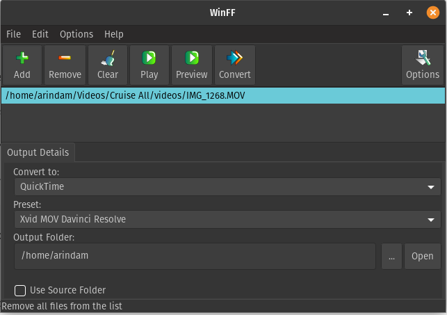

## How to convert videos / photos on linux(ubuntu based distros) to make them readable on DaVinci Resolve

* For photos imported from iPhone *

iPhone photos are is "heic" format which means by default once imported on ubuntu you wont be able to view them. 

so we need to convert them to jpg format.

Step 1:

install **libheif-examples** library

```
sudo apt-get install libheif-examples
sudo apt update
```
Step 2:

Once this is done, please run the attached script convertImg.sh file like this:

```
./convertImg.sh

```
Run this in the folder where you have the photos. This will convert all the photos to jpg format. (It won't delete the original files though)


## Video Conversation - to make videos compatible with Resolve

Sadly the free version of Resolve on Linux doesnt support H264 format which is the most widely used standard for most devices as well as youtube. So for that either you can purchase the studio version convert videos into compatible format. Here is how conversion can be done if the studio version is not needed for you since that is mainly catered for professional video editing studios. The windows or Mac version thoough support H264 so no worries if you are not on linux.

Step 1: Download the WinFF from ubuntu store. just search in software store and you should sees that.

</img>

Step 2: Click in the menu on Edit and select Presets.

Step 3: In the category / Preset list select the option QuickTime.

Step 4: Now in the Preset Name type “Xvid” (without quotes)

Step 5: In the Preset Label type "Xvid MOV Davinci Resolve" (without quotes) 

Step 6: In Preset Command Line type this:

```
-c:v libxvid -q:v 1 -c:a pcm_s24le
```
Step 7: In output file extension type "MOV" 

Step 8: In Category type: "QuickTime".

Step 9: No click add/update button. Show show like below.

</img>

You should see the Xvid MOV Davinci Resolve on the right.

Step 10: Click Save.

Done.

Now we are ready to start converting.

## Conversion

1) In Convert To select "QuickTime"
2) Select "Xvid MOV Davinci Resolve"
3) Select your output folder (this is where converted videos will get created) and drag drop your videos on top.
4) Click convert. 

</img>

5) Take a cup of coffee and enjoy. It may take few mins to hours depending on the length of video or how many you are converting.  You can add as many videos as you want before hittig the convert button. Personally I have converted about 150 videos together. Took an hour or so for the whole process. 


It will open a terminal and show the progress.

Once done, these videos should playback on linux as usual and will work in Resolve with audio.

